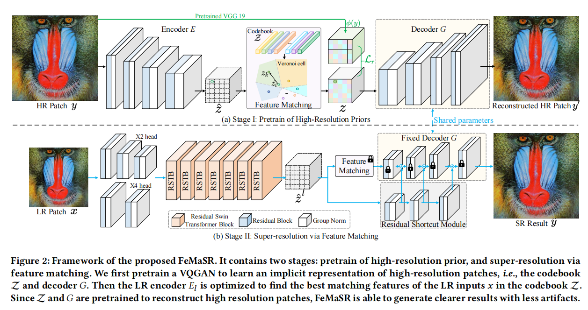
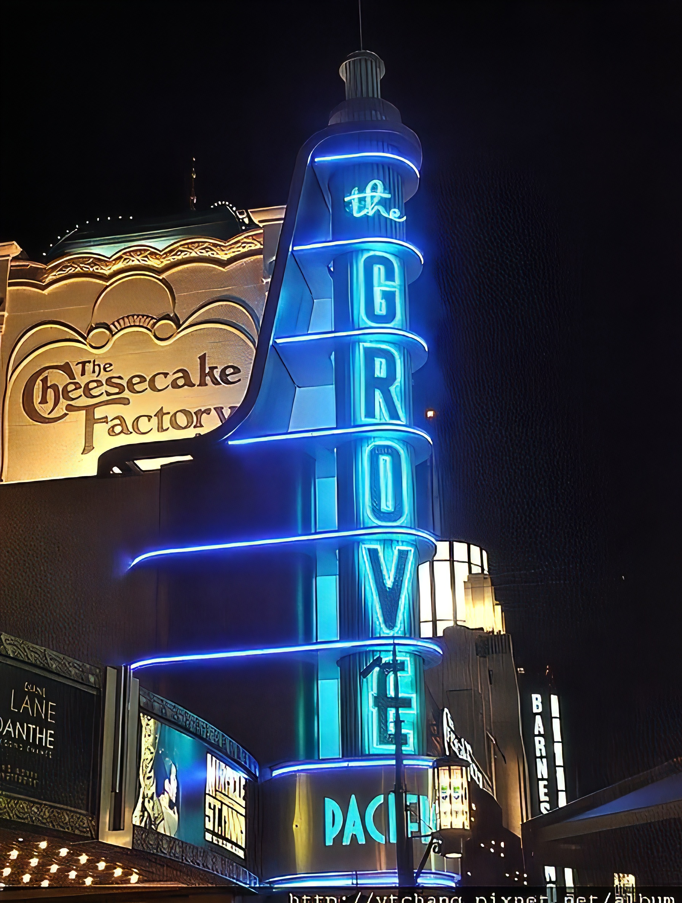
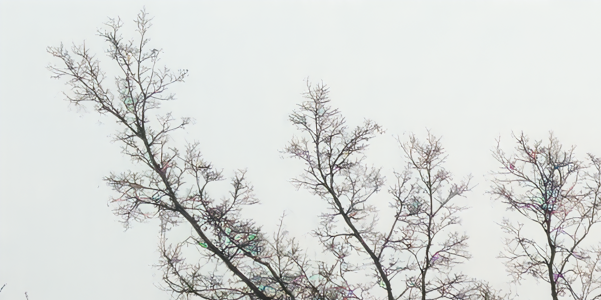
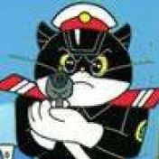
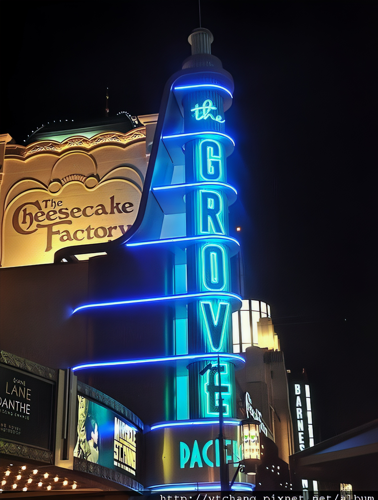

# FeMaSR 

This is the official PyTorch codes for the paper  
[Real-World Blind Super-Resolution via Feature Matching with Implicit High-Resolution Priors](https://arxiv.org/abs/2202.13142)  
[Chaofeng Chen\*](https://chaofengc.github.io), [Xinyu Shi\*](https://github.com/Xinyu-Shi), [Yipeng Qin](http://yipengqin.github.io/), [Xiaoming Li](https://csxmli2016.github.io/), [Xiaoguang Han](https://mypage.cuhk.edu.cn/academics/hanxiaoguang/), [Tao Yang](https://github.com/yangxy), [Shihui Guo](http://guoshihui.net/)   
(\* indicates equal contribution)



### Update

- **2022.07.02**  
      - Update codes of the new version FeMaSR   
      - Please find the old QuanTexSR in the `quantexsr` branch

Here are some example results on test images from [BSRGAN](https://github.com/cszn/BSRGAN) and [RealESRGAN](https://github.com/xinntao/Real-ESRGAN).

---

**Left**: [real images](./testset) **|** **Right**: [super-resolved images with scale factor 4](./results)

 
 
 
 
 

<!--  
 
 
 
  -->


## Dependencies and Installation

- Ubuntu >= 18.04
- CUDA >= 11.0
- Other required packages in `requirements.txt`
```
# git clone this repository
git clone https://github.com/chaofengc/FeMaSR.git
cd FeMaSR 

# create new anaconda env
conda create -n femasr python=3.8
source activate femasr 

# install python dependencies
pip3 install -r requirements.txt
python setup.py develop
```

## Quick Inference

```
python inference_femasr.py -s 4 -i ./testset -o results_x4/
python inference_femasr.py -s 2 -i ./testset -o results_x2/
```

## Train the model

### Preparation

#### Dataset

Please prepare the training and testing data follow descriptions in the main paper and supplementary material. In brief, you need to crop 512 x 512 high resolution patches, and generate the low resolution patches with [`degradation_bsrgan`](https://github.com/cszn/BSRGAN/blob/3a958f40a9a24e8b81c3cb1960f05b0e91f1b421/utils/utils_blindsr.py?_pjax=%23js-repo-pjax-container%2C%20div%5Bitemtype%3D%22http%3A%2F%2Fschema.org%2FSoftwareSourceCode%22%5D%20main%2C%20%5Bdata-pjax-container%5D#L432) function provided by [BSRGAN](https://github.com/cszn/BSRGAN). While the synthetic testing LR images are generated by the [`degradation_bsrgan_plus`](https://github.com/cszn/BSRGAN/blob/3a958f40a9a24e8b81c3cb1960f05b0e91f1b421/utils/utils_blindsr.py?_pjax=%23js-repo-pjax-container%2C%20div%5Bitemtype%3D%22http%3A%2F%2Fschema.org%2FSoftwareSourceCode%22%5D%20main%2C%20%5Bdata-pjax-container%5D#L524) function for fair comparison.

#### Model preparation

Before training, you need to
- Download the pretrained HRP model: [generator](https://github.com/chaofengc/FeMaSR/releases/download/v0.1-pretrain_models/FeMaSR_HRP_model_g.pth), [discriminator](https://github.com/chaofengc/FeMaSR/releases/download/v0.1-pretrain_models/FeMaSR_HRP_model_d.pth) 
- Put the pretrained models in `experiments/pretrained_models`
- Specify their path in the corresponding option file.

### Train SR model

```
python basicsr/train.py -opt options/train_FeMaSR_LQ_stage.yml
```

### Model pretrain

In case you want to pretrain your own HRP model, we also provide the training option file:

```
python basicsr/train.py -opt options/train_FeMaSR_HQ_pretrain_stage.yml
```

## Citation
```
@inproceedings{chen2022femasr,
      author={Chaofeng Chen and Xinyu Shi and Yipeng Qin and Xiaoming Li and Xiaoguang Han and Tao Yang and Shihui Guo},
      title={Real-World Blind Super-Resolution via Feature Matching with Implicit High-Resolution Priors}, 
      year={2022},
      Journal = {ACM International Conference on Multimedia},
}
```

## License

<a rel="license" href="http://creativecommons.org/licenses/by-nc-sa/4.0/"></a><br />This work is licensed under a <a rel="license" href="http://creativecommons.org/licenses/by-nc-sa/4.0/">Creative Commons Attribution-NonCommercial-ShareAlike 4.0 International License</a>.

## Acknowledgement

This project is based on [BasicSR](https://github.com/xinntao/BasicSR).
